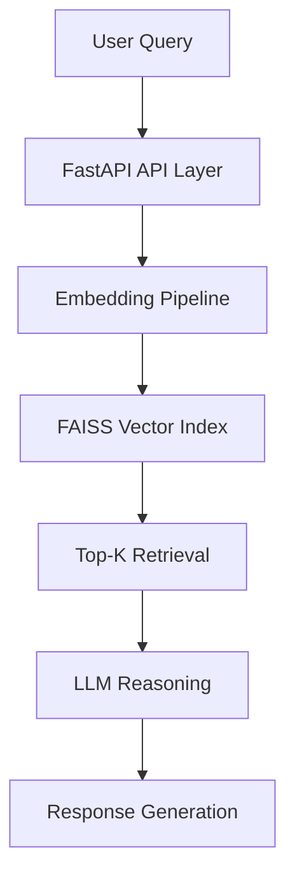

# 👋 Hi, I'm Prem Prakash  

<p align="center">
  
</p>

<p align="center">
  
</p>

<p align="center">
  
</p>

<p align="center">
  
</p>

---

## ⚡ About Me

💡 I build **production-grade AI backend systems** with scalability at the core  

- 🚀 LLM-powered systems (RAG, semantic retrieval)
- ⚡ High-performance async APIs (FastAPI)
- ☁️ Event-driven AWS architectures
- 🧠 Strong focus on system design & backend engineering  

---

## 🧠 Engineering Focus

```text
SYSTEM DESIGN → SCALABILITY → PERFORMANCE → RELIABILITY

• Async-first backend design
• Distributed system thinking
• AI + backend integration
• Low latency API architecture
```

---

## 🔍 Recruiter Keywords

`Python Backend Engineer` • `FastAPI` • `LLM` • `RAG` • `FAISS`  
`Semantic Search` • `AWS Lambda` • `SQS` • `EventBridge`  
`Async Programming` • `System Design` • `Microservices`  
`Docker` • `CI/CD` • `Scalable APIs`

---

# 🚀 🔥 FEATURED PROJECT

## 🧾 AI DOCUMENT CHAT SYSTEM (RAG ENGINE)

<p align="center">
  
  
  
</p>

---

### ⚙️ Architecture



---

### 🧩 Why This Stands Out

- 🔹 Async FastAPI → handles high concurrency  
- 🔹 Optimized embedding + retrieval pipeline  
- 🔹 FAISS vector search for low latency  
- 🔹 Clean modular backend architecture  
- 🔹 Designed like a **real production AI system**  

---

### 🌐 Project Link

<p align="center">
  <a href="https://github.com/prem-pjena/AI-Document-Chat-Backend-RAG-Based-System">
    
  </a>
</p>

---

## ⚙️ SECOND PROJECT

### ✈️ Event-Driven Travel Booking Platform

```text
Client → API Gateway → Lambda → SQS → EventBridge → Services
```

- Event-driven microservices architecture  
- Fully async workflows  
- JWT-secured APIs  
- Dockerized deployment  

<p align="center">
  <a href="https://github.com/prem-pjena/Travel-Event-Driven-Booking-Platform">
    
  </a>
</p>

---

## ✍️ Knowledge Sharing (Auto Blog)

<!-- BLOG-POST-LIST:START -->
🚧 Writing deep dives on:
- RAG system design  
- FastAPI scaling patterns  
- AI backend architecture  
<!-- BLOG-POST-LIST:END -->

---

## 🌐 Connect

<p align="center">
  <a href="mailto:premprakashjena04@gmail.com">
    
  </a>
  <a href="https://www.linkedin.com/in/premprakashj/">
    
  </a>
  <a href="https://github.com/prem-pjena">
    
  </a>
</p>

---

## ⚡ Philosophy

<p align="center">
  <i>"Scalable systems are built intentionally, not accidentally."</i>
</p>
